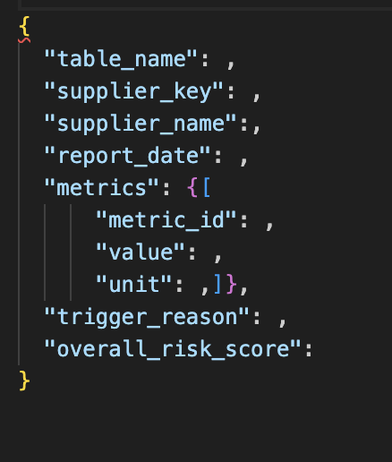
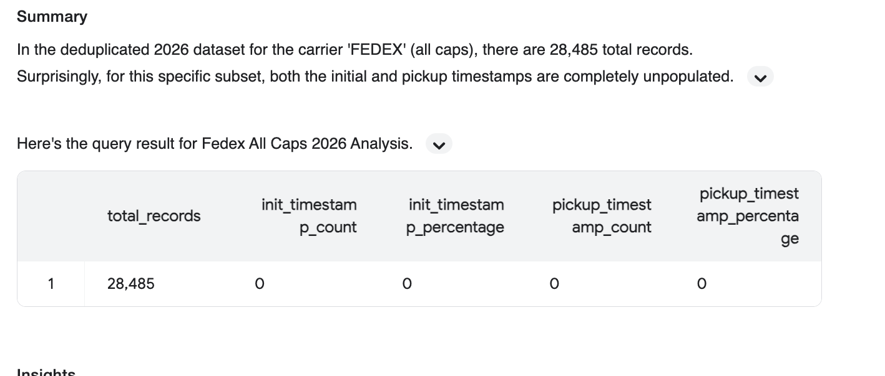
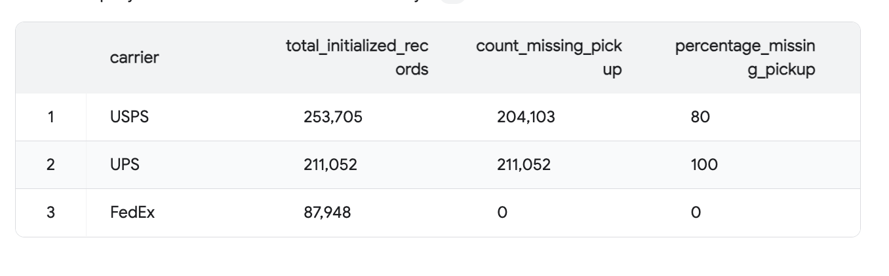

# Shipping Behavior Risk Metrics

## Data Source

**Table:** `app_production_tracking_hub_trackingLabels`

**Output Format:**




**Key characteristics:**
- CDC (Change Data Capture) table — multiple rows per package, deduplicated by latest `_sdc_sequence` per `sk`
- Soft deletes via `_sdc_deleted_at`
- Data updates twice daily at UTC 00:00 and 12:00, with the primary batch arriving at UTC 12:00
- Pipeline is scheduled to run at **UTC 14:00 (EST 9:00am)** daily to ensure data completeness

**Carrier coverage findings (2026 data):**

| Carrier | init_timestamp | pickup_timestamp | Usable For |
|---|---|---|---|
| FedEx (`carrier = 'FedEx'`) | ~94% | 100% of initialized | Metric 1 + 3 |
| UPS | ~93% | 0% | Metric 1 only |
| USPS | ~48% | 16% | Metric 1 (with caveat) |
| `FEDEX` (all caps) | 0% | 0% | Ghost order detection |
| AMZN_US, OnTrac, others | 0% | 0% | Excluded |

**Key discovery:** `carrier = 'FedEx'` and `carrier = 'FEDEX'` are two distinct data sources. The all-caps variant has zero timestamp coverage and is treated separately as a fraud signal (`FEDEX_UNACTIVATED`).

---

## Metric 1 — Untracked Order Rate

**What it measures:** The proportion of orders that have no `init_timestamp` (i.e. no record of the shipment being handed to a carrier) after a 3-day SLA buffer.

**Logic:**
- An order is considered **untracked** if ALL of its packages have no `init_timestamp` after 3 days from `order_date`
- Computed daily per supplier per carrier
- Compared against a 30-day rolling average baseline to surface anomalies (`diff = today - rolling_avg_30d`)



Is this due to a data entry error, or does the order actually not have tracking information?

**Carriers included:**

| carrier_normalized | Reason |
|---|---|
| `FEDEX` | High coverage, reliable signal |
| `UPS` | High coverage, reliable signal |
| `USPS` | Lower coverage (~48%), included for comparison against carrier baseline |
| `FEDEX_UNACTIVATED` | Always untracked_rate = 1.0; high order volume = strong fraud signal |

**Key design decisions:**
- Only orders older than `ship_sla_days = 3` are evaluated, to avoid flagging same-day orders that haven't shipped yet
- `diff` is compared against the carrier-level baseline on the same day to distinguish supplier-specific anomalies from systemic carrier issues
- `FEDEX_UNACTIVATED` is treated separately: `diff ≈ 0` and `untracked_rate = 1.0` are both expected and permanent for this carrier — the risk signal is **order volume**, not rate deviation

**Notable:** 138 suppliers have orders sitting in `FEDEX_UNACTIVATED` status — labels created but never activated in FedEx's system. This warrants further investigation as a potential fraud signal.

---

## Metric 2 — Price Escalation Detection

**What it measures:** Whether a supplier's average order value has spiked significantly compared to their own historical baseline.

**Logic:**
- Computes daily `avg_order_value` per supplier
- Calculates z-score against the supplier's own 30-day rolling mean and standard deviation
- Two signals: `zscore` (average daily price) and `max_zscore` (single highest-value order)
- `total_cost` is an order-level field repeated across packages, so it is deduplicated by `order_id` before aggregation

**Key design decisions:**
- Suppliers with fewer than 30 days of history or only 1 data point return `zscore = NULL` — treated as neutral, not risky
- `max_zscore` catches one-off large orders that would be diluted in the average
- `zscore >= 2.0` — average daily order value is significantly elevated (flags gradual price inflation)
- `max_zscore >= 5.0` — a single order is extremely far above the supplier's norm (flags one-off large suspicious orders that would be diluted in the daily average)


---

## Metric 3 — FedEx Pickup Lag (3A)

**What it measures:** The time between label creation (`init_timestamp`) and carrier pickup (`pickup_timestamp`) for FedEx shipments. A rising trend may indicate the seller is delaying handing off packages — a potential fraud signal.

**Why FedEx only:**
- FedEx is the only carrier with reliable pickup_timestamp data in 2026 (100% coverage for initialized records)



**Logic:**
- `pickup_lag_days = DATE_DIFF(pickup_date, init_date, DAY)` per package
- Aggregated daily per supplier: `avg_pickup_lag`, `max_pickup_lag`
- Compared against 30-day rolling average: `diff = avg_pickup_lag - rolling_avg_30d`

**Note on Metric 3B (Stuck Orders):**
We initially designed a "stuck orders" metric for packages with `init` but no `pickup` after 5 days. This was deprecated because:
- FedEx 2026: 0 stuck orders (100% init-to-pickup sync) — metric produces no signal
- UPS/USPS: 400,000+ "stuck" orders, but confirmed to be a data integration gap, not real shipping delays


---

## Risk Scoring

After the three metrics are computed, an LLM-based scorer evaluates each supplier daily.

Suppliers are skipped (score defaulted to 0) if they have insufficient order volume: no carrier with ≥ 5 orders and no price data with ≥ 5 orders.

---

### Scoring Architecture

Scoring is split between Python (quantitative) and LLM (qualitative + price/lag).

**Step 1 — Python computes `untracked_score` (0–8):**

For each carrier (FEDEX, UPS, USPS) with ≥ 10 orders:

```
confidence = min(1.0, exp(order_volume / 50) / exp(3))
carrier_score = untracked_rate × confidence × 30
```

Carrier scores are combined using **sqrt(sum of squares)** and capped at 8. This gives diminishing returns for multi-carrier stacking — two carriers at moderate risk score less than one carrier at high risk.

The confidence function is steeply exponential — full confidence (1.0) is reached at ~150 orders. Carriers with fewer than 10 orders are excluded from scoring entirely but their raw rate is still stored in `metrics`.

| Orders | Confidence | 100% rate score |
|--------|-----------|----------------|
| 10 | 0.061 | 1.82 |
| 50 | 0.135 | 4.06 |
| 72 | 0.210 | 6.30 → cap 8 |
| 150 | 1.000 | 30 → cap 8 |

**Step 2 — Python computes `price_weight` based on `untracked_score`:**

| untracked_score | price_weight |
|---|---|
| ≥ 3 | 1.0 |
| 1 – 3 | 0.6 |
| < 1 | 0.3 |

Price signals matter most when untracked activity is already elevated. A supplier with high price escalation but normal shipping behavior is weighted down.

**Step 3 — LLM adjusts `untracked_score` for carrier-level systemic issues:**

Each carrier's `carrier_baseline` (overall untracked rate across all suppliers for that carrier on the same day) is passed to the LLM. This allows the LLM to distinguish supplier-specific risk from system-wide carrier problems (e.g. USPS outage affecting everyone).

| Carrier baseline | Supplier vs baseline | Adjustment |
|---|---|---|
| ≥ 50% | Within 15pp of carrier rate | × 0.5 (systemic issue, not supplier-specific) |
| ≥ 50% | Exceeds carrier by > 15pp | × 1.0 (supplier meaningfully worse than carrier) |
| 20–50% | Supplier notably higher | × 0.75 (mixed signal) |
| < 20% | Supplier significantly higher | × 1.0 (clear supplier-specific risk) |
| Absent | — | × 1.0 |

**Step 4 — LLM scores price escalation and pickup lag, then combines:**

Price escalation (raw score before weight):

| Z-score | Raw price score |
|---|---|
| NULL or < 2.0 | +0 |
| 2.0 – 3.0 | +1 |
| 3.0 – 4.5 | +2 |
| > 4.5 | +3 |

Additional +1 if `max_zscore` is much higher than `latest_zscore` with ≥ 5 orders (concealed high-value order signal).

`price_contribution = raw_price_score × price_weight`

FedEx pickup lag (supporting signal only, +0 or +1):
- Only applied when untracked or price is already elevated
- `diff_vs_baseline > 2 days` → +1

**Final score:**
```
overall_risk_score = untracked_score + price_contribution + lag_adjustment
```
Capped at 10. Result is a decimal.

---

### Output

**`ship_risk_scores`** (append-only, one row per run per supplier):
- `overall_risk_score`: decimal 0–10
- `trigger_reason`: explanation citing specific raw values (rate, order volume, z-score)
- `metrics`: snapshot of latest metric values
- `supplier_name`: backfilled from BigQuery at pipeline runtime

**`consolidated_flagged_supplier_list`** (upsert by `supplier_key + source`):
- Suppliers with `overall_risk_score ≥ 6` are written here
- Updated each run — always reflects the latest score

---

### Score Interpretation

| Score | Interpretation |
|---|---|
| 0–2 | Normal behavior, no action needed |
| 3–4 | Minor anomalies, worth monitoring |
| 5–6 | Meaningful risk signals, flag for review |
| 7–8 | Strong signals, multiple metrics elevated |
| 9–10 | Critical risk, strong fraud or default indicators |

**Authoritative scoring rules:** [`prompts/llm_risk_scorer.md`](./prompts/llm_risk_scorer.md)